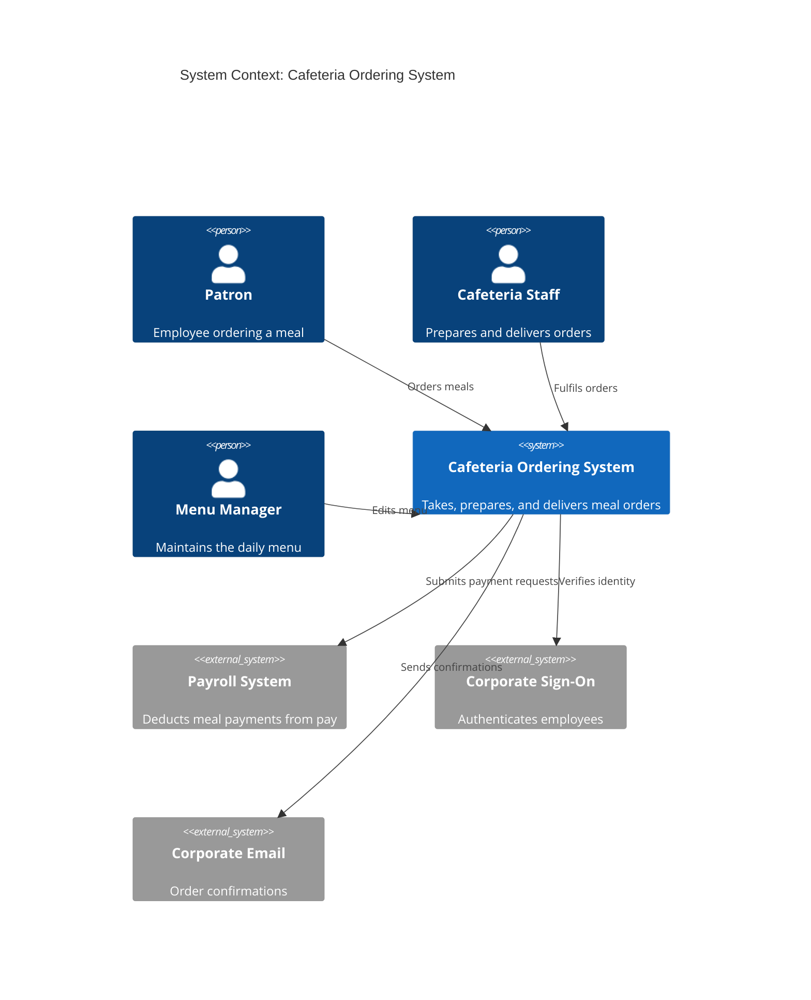

# Architectural Design

**Project:** _[Your project name]_
**Team:** _[Team NN]_
**Client:** _[Client name and organization]_
**Version:** 0.1

---

_**How to use this template.** Instructions appear in italic square brackets. Fill in underneath them and leave them in place until the document is stable. Every section says which checkpoint it is due at. A section that is not due yet stays as it is; do not fill it with guesses to make the document look finished._

_**What this document is.** Your system's **architecture-of-record**: the one map of the whole system, every use case area, every component, every external system, and the few decisions that are expensive to change later. It is **breadth-complete and depth-shallow**. Every part of the system is named, and nothing is designed further than its responsibility. How one use case works inside its component is a design-of-record, which comes in week 7, one per use case area, and it is written against real code._

_**What it is not.** A second copy of your requirements. The specification says what the system must do and how well; this document says how the system is shaped to do it. It **cites** `UC-*`, `CO-*`, `SEC-*`, `PER-*` and the rest by identifier and never restates them. A threshold that appears here and nowhere in the specification is a requirement hiding in the wrong document._

_**The test for what belongs here.** Decide now what is hard to reverse, affects the whole system, and is forced by a quality attribute or a constraint: how many deployables, where the data lives, how users sign in, which external systems you depend on. Leave to per-area design what is local and cheap to change: class names, endpoint shapes, table columns._

_**Structure.** The sections follow **arc42** (Starke and Hruschka), with **C4** diagrams (Simon Brown) for context and containers, written as mermaid so they diff in git. Sections that do not apply to a student project have been dropped. The full worked example is Project Pulse's [architecture-of-record](https://github.com/Washingtonwei/project-pulse/blob/main/docs/design/architectural-design.md); read it for the shape, then write your own, because your client's quality attributes are not Project Pulse's.]_

## Identifiers

_[The new identifiers this document creates. Everything else it cites keeps the identifier of the document that owns it.]_

| Space | For | Example |
|---|---|---|
| `KD-<slug>` | Key architectural decisions | `KD-single-deployable` |
| `QS-<slug>` | Quality scenarios | `QS-cross-employee-order-denied` |
| `RISK-<slug>` | Technical risks | `RISK-payroll-api-unavailable` |
| `TD-<slug>` | Technical debt the architecture knowingly carries | `TD-no-rate-limiting` |

_[Project Pulse numbers its decisions and scenarios (`KD-1`, `QS-1`). Yours use slugs, like every other identifier in your project, so an inserted decision renumbers nothing and a citation says what it points at.]_

## Revision History

| Version | Date | Author | Change |
|---|---|---|---|
| 0.1 | | | Initial draft for Checkpoint 1 |

---

## 1. Introduction and Goals

_Due: Checkpoint 1._

### 1.1 Quality goals

_[The **three** quality attributes that most shape your system, in priority order. Pick them from section 9 of your [specification](../requirements/software-requirements-specification.md) and cite their identifiers. If you cannot rank them, ask your client which one they would give up first; that answer is the ranking._

_What does not go here: the requirements overview (it is your specification) and the stakeholders (they are in [vision and scope](../requirements/vision-and-scope.md)). Link to both; do not copy either._

_Example, from the Cafeteria Ordering System:]_

| Priority | Quality goal | Specification handles | Why it shapes the architecture |
|---|---|---|---|
| 1 | _Payroll data stays confidential_ | _`SEC-payroll-auth`, `SEC-employee-own-orders`_ | _Orders are paid by payroll deduction, so an order record carries an employee's pay account. A leak is a legal problem, not a bug._ |
| 2 | _Orders placed before 10:00 are not lost_ | _`ROB-order-persisted`, `AVL-lunch-window`_ | _The lunch rush is the only load that matters, and a lost order is a hungry employee with a payroll charge._ |
| 3 | _Cafeteria staff can run it without IT_ | _`CO-no-dedicated-ops`, `MNT-menu-self-service`_ | _Nobody on the cafeteria side can deploy, restart, or patch anything._ |

## 2. Constraints

_Due: Checkpoint 1._

_[The constraints the architecture has to honor. They are already written as `CO-*` in section 2.4 of your specification, and `OE-*` in section 2.3; **list the identifiers here, do not restate them.** Add one sentence only where a constraint narrows an architectural choice in a way that is not obvious from its text._

_Your technology stack is a constraint only if something external fixes it: the client's IT department, an existing system, or the person who maintains this after you graduate. A stack your team chose is a decision, and it goes in section 6 with the alternative you rejected.]_

## 3. Context and Scope

_Due: Checkpoint 1._

_[One C4 context diagram: your system as a single box, every kind of user, and **every external system** it talks to (email, payment, an identity provider, a client database, an LLM, a file store). An external system you discover in November is a schedule risk you could have seen in October._

_Draw the **trust boundary**: the line between what you control and what you do not. Everything that crosses it is where security requirements apply. Then write two or three sentences: which users are inside, what sensitive data the system holds, and which external systems receive any of it._

_Example:]_

## 4. Solution Strategy

_Due: Checkpoint 1._

_[Three to five bullets: the load-bearing moves, each pointing at the decision in section 6 that explains it and the quality goal it serves. If a bullet points at no decision, either it is not load-bearing or a decision is missing.]_

## 5. Building Block View

_Due: Checkpoint 1. This section is most of what your TA checks._

### 5.1 Containers

_[One C4 container diagram: the separately running or separately stored pieces inside your system box. For most projects that is a front end, a back end, and a database, and sometimes a file store. Name each container's technology. Every external system from section 3 appears again here, attached to the container that talks to it._

_Three containers is a normal answer. If you have more than five, check each one against section 6: which decision, driven by which quality attribute, requires it to run separately?]_

### 5.2 Use case areas and components

_[One row per use case area in your [use cases](../requirements/use-cases.md), taken from the area column of [traceability.md](../traceability.md) section 1, plus one row per **cross-cutting component** that no single area owns (authentication, notifications, file handling, an integration with an external system). A use case area with no row is a part of your system with no home; a component with no area and no cross-cutting reason is one nobody asked for._

_**Responsibility** is one sentence, what the component owns, not how it works. **Depends on** names other components and external systems, never classes. **Status** is `provisional` until the component has been built through at least one use case, and `proven` after that. At Checkpoint 1 every row is `provisional`; Checkpoint 2 turns at least one to `proven`._

_Example:]_

| Use case area | Component | Responsibility | Depends on | Status |
|---|---|---|---|---|
| _`ORD`_ | _Ordering_ | _Owns an order from placement to cancellation, and the cut-off rules_ | _Menu, Payment, Identity_ | _provisional_ |
| _`MNU`_ | _Menu_ | _Owns daily menus and item availability_ | _Identity_ | _provisional_ |
| _`DEL`_ | _Delivery_ | _Owns delivery slots and the staff's fulfilment queue_ | _Ordering, Notification_ | _provisional_ |
| _(cross-cutting)_ | _Payment_ | _The only component that talks to the Payroll System_ | _Payroll System_ | _provisional_ |
| _(cross-cutting)_ | _Identity_ | _Maps a signed-on employee to a role_ | _Corporate Sign-On_ | _provisional_ |
| _(cross-cutting)_ | _Notification_ | _Sends every email the system sends_ | _Corporate Email_ | _provisional_ |

_[Check before Checkpoint 1: every area in your use case file appears in the first column, and every external system in section 3 appears in some Depends on cell.]_

## 6. Architecture Decisions

_Due: the table and one decision at Checkpoint 1; more as they are made._

### 6.1 Architecturally significant requirements

_[Not every requirement shapes the architecture. The **architecturally significant requirements** are the few that do: quality attributes and constraints where a wrong guess costs a redesign, not a bug fix. Functionality can be delivered by many structures; these are what choose among them._

_List three to six, ranked by importance to your client times difficulty to achieve. Reuse the specification's identifiers, never new ones. **At least one row is a `SEC-*` attribute.** Every system your team builds this year holds some personal data, and if no security requirement appears here, that data's protection was never designed; it will be added later, which is where security bugs come from.]_

| Rank | Requirement | Specification handles | Importance × difficulty | Drives |
|---|---|---|---|---|
| 1 | _Payroll data confidential_ | _`SEC-payroll-auth`_ | _High × Medium_ | _`KD-payment-isolated`_ |

### 6.2 Key decisions

_[One entry per decision, in the form below. Checkpoint 1 requires exactly one: **`KD-deployment-shape`**, whether your system ships as one deployable or several, and why. Every team makes this decision, and it is where over-engineering usually shows up first. Add others when you make them; do not invent them to fill the section._

_A decision without a **rejected alternative** is not a decision, it is a description. Name what you did not do and why not, so the next person does not redo the argument._

_Example:]_

**`KD-deployment-shape`: one deployable.** _Accepted._

- **Driving requirements:** _`CO-no-dedicated-ops`; `AVL-lunch-window`._
- **Context:** _About 400 patrons, one lunch peak a day, and nobody on the client side who can operate infrastructure._
- **Decision:** _The front end is built into the back end's package and ships as one container to one host, with one managed database._
- **Rejected:** _Separate services for ordering, menu, and delivery. They would add network calls, three deployments, and failure modes between them, to solve a scaling problem 400 users do not have._
- **Trade-off:** _The system scales only as a whole, and a bad deploy takes all of it down._

## 7. Crosscutting Concepts

### 7.1 Security

_Due: named at Checkpoint 1, detailed at Checkpoint 2._

_[Three short paragraphs, each citing the `SEC-*` requirement it answers:_

- _**Authentication:** how a user proves who they are, and who issues the credential (your system, the client's sign-on, a third party)._
- _**Authorization:** the roles, and the rule for what a user may see beyond their role (a patron sees only their own orders). The second part is where most real breaches happen._
- _**Sensitive data:** what personal or regulated data the system stores, in which container, and which external systems receive any of it._

_Secrets (passwords, API keys, connection strings) never appear in this document or in the repository. Say where they will live, not what they are.]_

### 7.2 Other concepts

_Due: when they appear. [Error handling, logging, validation, time zones: anything every component must do the same way. Add a subsection the first time two components would otherwise do it differently.]_

## 8. Runtime View

_Due: Checkpoint 2. [One sequence diagram, for the use case your proving slice builds, from the user's action through every container and external system it touches. Leave this section empty until the slice exists; a sequence diagram of code nobody has written describes a guess.]_

## 9. Deployment View

_Due: Checkpoint 3. [Where each container runs, how a change reaches it, and what happens to state on a restart. Filled in once your pipeline exists, after week 11.]_

## 10. Quality Scenarios

_Due: one scenario at Checkpoint 2; one per top-ranked requirement in section 6.1 by Checkpoint 3._

_[A quality attribute says how good; a scenario says how you will know. Each one is: a **source** does a **stimulus** in an **environment**, the system gives a **response**, and a **measure** tells you it worked. The measure cites the specification's attribute for its number; it never introduces one._

_Which test verifies each scenario is recorded in [traceability.md](../traceability.md), not here.]_

| ID | Source and stimulus | Environment | Response | Measure |
|---|---|---|---|---|
| _`QS-cross-employee-order-denied`_ | _A signed-on patron requests another patron's order by its ID_ | _Normal operation_ | _Refused before any order data is read_ | _Every such request is refused and returns no order fields (`SEC-employee-own-orders`)_ |

## 11. Risks and Technical Debt

_Due: seeded at Checkpoint 1, kept current after._

_[**Technical** risks and debt only. Business and project risks are `RI-*` in [vision and scope](../requirements/vision-and-scope.md); do not copy them here. Seed this list from the technical `RI-*` items and from any [OPEN-ISSUES.md](../requirements/OPEN-ISSUES.md) entry whose answer could change the architecture._

_A **risk** might happen: an external system you have never called, a client dataset you have never seen. **Debt** has already happened: a shortcut you took on purpose and intend to pay back. Each row says how you would find out, or how you would fix it._

_A risk written as a category ("security", "performance") is not a risk. Write the mechanism: what fails, and what that breaks.]_

| ID | Type | What could go wrong, and what it breaks | Mitigation or fix | Cites |
|---|---|---|---|---|
| _`RISK-payroll-api-unavailable`_ | _Risk_ | _Nobody has seen the Payroll System's interface. If it only accepts a nightly batch file, ordering cannot confirm payment at order time._ | _Ask for the interface document at the next client meeting; build Payment against a stub until then._ | _`DE-payroll-integration`, `OI-4`_ |

## 12. Glossary

_[Domain terms live in your [project glossary](../requirements/project-glossary.md). Link it and add nothing here unless you need an architecture term your team uses in a special sense.]_

---

## Working this document with your agent

_[Delegate: drawing the C4 diagrams in mermaid from your use case list and your specification's interfaces; checking that every use case area has a component and every external system has a component that depends on it; checking that every identifier this document cites exists in the document that owns it; drafting the rejected alternative for a decision you have already made._

_Keep human: the ranking in section 6.1 and every `KD-*`. The decisions are the part of this document your client and next spring's team will hold you to, and they depend on facts about your client that are not in any file._

_**The specific failure to watch for: over-engineering.** Ask an agent for an architecture and it will propose the one it has seen most often in writing, which is built for a company a thousand times your size: microservices, a message queue, Kubernetes, a cache in front of a database that holds ten thousand rows. Every one of those is a real answer to a problem you do not have, and each one adds something that can break at 2 a.m. with nobody to fix it. For every container and every decision the agent proposes, ask which requirement in section 6.1 forces it. If the answer is none, cut it.]_
