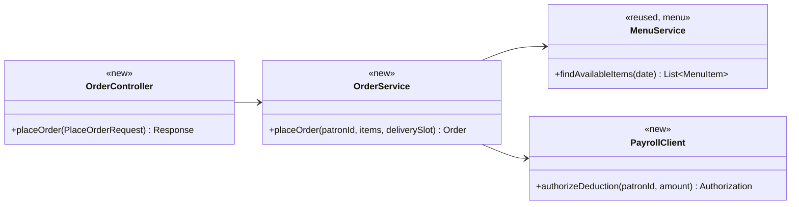
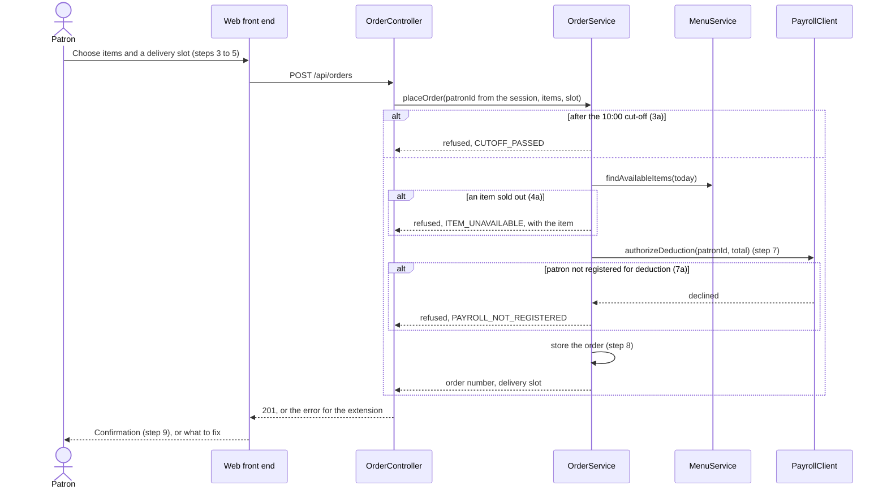

# _[Area name]_ Design

**Project:** _[Your project name]_
**Team:** _[Team NN]_
**Area:** _[`UC-<AREA>`, for example `ORD`]_

> **Realizes:** _[every `UC-<AREA>-<slug>` and `FR-<AREA>-<slug>` this document designs, appended as each is designed]_
> **Depends on:** _[the business rules, constraints, and cross-cutting `FR-*` it builds on, by identifier]_
> **See:** _[links to the use cases, the specification, and your [architecture-of-record](architectural-design.md)]_
> **Designed against:** _[the commit of `main` you read the code at, for example `a1b2c3d`]_

---

_**How to use this template.** Copy it to `docs/design/<area>.md`, named for the lowercase area code (`ord.md` for `UC-ORD-*`). Instructions appear in italic square brackets; leave them in place until the document is stable, because the agent reads them on every later pass. The full worked example is Project Pulse's [`not.md`](https://github.com/Washingtonwei/project-pulse/blob/main/docs/design/not.md); read it for the shape, not for the answers._

_**What this document is.** The **design-of-record** for one use case area: how the code will realize its use cases, written **before** the code and approved before anyone builds from it. It is the last document your agent reads before it writes code, so anything it leaves out, the agent invents. Your [architecture-of-record](architectural-design.md) is the map of the whole system and stops at each component's responsibility; this document goes one level down, inside one area, against real code._

_**What it is not.** A copy of your use cases. It **cites** `UC-*`, `FR-*`, and `BR-*` by identifier and never restates what the system shall do; it says only how. It is also not a transcript of the code. Once code exists, link to the files rather than describing every class, column, or getter._

_**One document per area, not per use case.** Your area gains use cases over the term. The overview, the class diagram, and the data model are **revised in place** when it does. The sequence diagrams, the API contract rows, and the test rows are **appended**, one set per use case. Never add a `## UC-…` section that repeats the whole skeleton._

_**How much to write.** Pin down what a wrong guess would break: a requirement, a business rule, a quality attribute, or the contract between two parts of your team. Leave the rest for the agent to derive while it builds: variable names, field types, exact JSON, column lengths. When you are unsure, ask which side of that line a detail falls on, not whether it is interesting._

_**Write it in this order.** Each step is one person's or one pair's work, and the order is the point:_

1. _**Sketch it yourselves first.** Before you open the agent, draw the main success scenario's sequence diagram and write the API contract rows by hand, from the use case and your architecture-of-record. Twenty minutes, on paper or in this file._
2. _**Have the agent draft it.** Give the agent this template, the use case, the business rules it cites, your architecture-of-record's section 8 (Crosscutting Concepts), and the relevant existing code, and ask for a draft of this document. Use plan mode, so it proposes before it writes._
3. _**Compare the two.** Where the agent's draft differs from your sketch, decide which is right and why. What it found that you missed goes in; what you knew that it could not have known is the context your specification is missing, so fix the specification too._
4. _**Run the questions test** (the last section) and fix what it finds._
5. _**Open a pull request.** A teammate who did not write it reviews and approves it. Nobody starts an implementation branch from this design until it is merged._

---

## Overview

_[One paragraph: what this area does, which components of your [architecture-of-record](architectural-design.md) it lives in, and what it reads from or calls in other areas. Link the container diagram rather than redrawing it. If this design changes the architecture-of-record, say so here and list the change under "Changes to the architecture-of-record" below._

_Example, from the Cafeteria Ordering System:_

_Ordering takes a patron's meal order from menu selection to a confirmed, payroll-charged order. It is the `ORD` area of the API ([containers](architectural-design.md#51-containers), [use case areas](architectural-design.md#52-use-case-areas-and-components)), reads the day's menu from `menu`, and asks the Payroll System to authorize the deduction before an order is stored (`DE-payroll-integration`).]_

## Components & classes

_[One class diagram for the whole area, and one line per class or file saying what it does and whether it is **new** or **reused**. Show only what a reader needs to see how the parts relate: classes, their key methods, their dependencies. Fields and getters belong to the code._

_**If your repository has no code for this area yet**, which is the normal case for your proving slice, list the files you expect the agent to create, with the paths your architecture-of-record's conventions give them, and mark them all new. The agent then builds into the structure you chose rather than one it improvised._

_Example:_]

- _`ordering/OrderController` (new): the HTTP entry point; validates the request shape and nothing else._
- _`ordering/OrderService` (new): checks the cut-off, availability, and payroll authorization, then stores the order._
- _`ordering/PayrollClient` (new): the only class that talks to the Payroll System._
- _`menu/MenuService` (reused): called through its service, never its repository._

## Sequence

_[One sequence diagram per use case for its main success scenario, plus one for each extension that does not just return an error. **Label each interaction with the use case step it implements**, so a reviewer can check that every step is realized and nothing extra was invented. Use `alt` blocks for extensions that branch off the main flow. Give each use case its own `###` heading; that heading is the anchor your traceability matrix cites._

_Example:]_

### _UC-ORD-place-order: placing an order_

## API contract

_[One row per endpoint, scheduled job, or message this area adds or changes, appended per use case. **This section is never dropped**: before the code exists it is the only thing the person (or agent session) building the front end and the one building the back end both read. Name the caller and who may call it, the request fields, the success response, and the error each extension returns. Leave field types and exact JSON to the agent unless a wrong guess would break something, such as a format another system depends on. Use the error shape your architecture-of-record's section 8.2 fixes; do not invent one here._

_Example:]_

| Endpoint or job | Caller (who may) | Request | Success | Errors, by extension |
|---|---|---|---|---|
| _`POST /api/orders`_ | _A signed-in patron, for herself only; the patron comes from the session, never the body_ | _Menu item ids and quantities, delivery slot id_ | _`201`: order number, total, delivery slot_ | _3a: `409 CUTOFF_PASSED`. 4a: `409 ITEM_UNAVAILABLE` naming the item. 7a: `402 PAYROLL_NOT_REGISTERED`. Not signed in: `401`._ |
| _`GET /api/orders/{orderId}`_ | _The patron who placed it, or cafeteria staff_ | _None_ | _`200`: items, total, slot, status_ | _Another patron's order: `404`, so the response does not reveal that the order exists (`QS-cross-employee-order-denied`)._ |

## Key decisions

_[Only the decisions a reader could not recover from the code: an invariant, who may do this and how it is enforced, a trade-off you chose, a reason you reused something rather than writing it. **Each one names what you chose, what you rejected, and why.** If you cannot name an alternative you considered, it probably was not a decision; leave it out._

_A decision that affects the whole system rather than this area is an architecture decision. It belongs in your architecture-of-record as a `KD-*` entry, not here._

_Example:]_

**_When the payroll deduction is authorized._** _Before the order is stored, in the same request. Rejected: storing the order first and charging later in a batch, because a declined deduction would then cancel an order the kitchen has already started (`ROB-order-persisted` promises the patron that a confirmed order stands)._

**_How the cut-off is checked._** _On the server, against the injected clock, in the cafeteria's time zone (architecture-of-record 8.2, time). Rejected: hiding the order button after 10:00 in the browser, because the browser's clock is the patron's and the check would be advisory._

## Data model

_[The **change** this area makes to the data: new tables or entities, new columns, the migration that adds them. Draw an ER diagram when there is more than one new table. Do not redraw the domain model; your [specification](../requirements/software-requirements-specification.md) owns it, so link it and show only the change. If the area changes nothing, say "No change" and give the reason in one line; that is a design decision too.]_

## Reuse & cross-cutting

_[Which existing services, components, and conventions this area uses rather than rebuilding: authentication, the error handler, email, the clock, another area's service. Cite your architecture-of-record's section 8.2 for each convention by name rather than restating it.]_

## Tests

_[One row per flow: the main success scenario and **every** extension of every use case this document realizes, appended per use case. Name the level (unit or integration) and what the test asserts. No code. This list is the definition of done that the reviewer approves; the agent writes these tests when it builds, and a reviewer can see at a glance whether an extension has no test._

_Example:]_

| Use case, flow | Level | Asserts |
|---|---|---|
| _UC-ORD-place-order main_ | _integration_ | _A registered patron's order before 10:00 is stored, charged once, and returned with an order number_ |
| _UC-ORD-place-order 3a_ | _unit_ | _At 10:00:01 by the injected clock the order is refused with `CUTOFF_PASSED` and nothing is stored or charged_ |
| _UC-ORD-place-order 4a_ | _unit_ | _A sold-out item refuses the whole order and names the item_ |
| _UC-ORD-place-order 7a_ | _integration_ | _A declined deduction stores no order_ |
| _Authorization_ | _integration_ | _A patron requesting another patron's order gets `404`_ |

## Changes to the architecture-of-record

_[Designing an area against real code is when the architecture's guesses meet reality. If this design needs a component the map does not have, moves a responsibility, or adds a dependency, **change [the architecture-of-record](architectural-design.md) in the same pull request** and list each change here in one line. If nothing changed, write "None". A design that silently disagrees with the architecture leaves two maps, and the agent will follow whichever it reads last.]_

## Open questions & risks

_[What this design could not settle and who can, and what could go wrong that you are accepting. A question for the client also goes in [`OPEN-ISSUES.md`](../requirements/OPEN-ISSUES.md).]_

---

## Working this document with your agent

_[Delegate: drafting the diagrams from your sketch and the use case; listing the existing files a class should extend; filling the contract rows' request and response fields; proposing the test row for each extension; drafting the rejected alternative for a decision you have already made; checking that every identifier this document cites exists in the document that owns it._

_Keep human: which side of the "would a wrong guess break something" line each detail falls on; every key decision; and the approval, which is a teammate's review of the pull request, not the drafter's own reading._

_**The specific failure to watch for: scope that nobody asked for.** An agent drafting a design adds what designs it has read usually have: an admin override, a retry queue, a status field, a notification "while we are here". Each looks reasonable and none is in your use case, and once it is in the design the agent will build it, test it, and you will maintain it. Read the sequence labels: every interaction should name the use case step it implements. An interaction with no step is either a missing requirement, which goes to your specification and your client, or scope creep, which comes out.]_

---

## The questions test (before you open the pull request)

_[Start a **fresh** agent session in plan mode, so it carries nothing from the session that drafted this document. Give it only the use case, the business rules it cites, your architecture-of-record's section 8, and this document, and ask:_

> _List every point you would still have to guess to implement `<UC-ID>`. For each, say what you would guess and whether a wrong guess could violate a requirement. Do not write code._

_For each item on its list, either fix this document or keep the guess and write one line saying why a wrong guess breaks no requirement. Paste the list, with your answer to each item, into the pull request description. The design is ready when nothing on the list could break a requirement.]_
